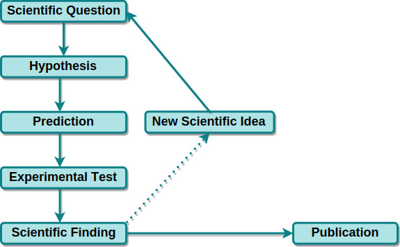

## Science
Aim: understand \<system\>* better (* molecule, species, earth, universe, ...)

<centering></centering>

software as essential, but a side aspect

---

## Scientific Reality
 
<centering></centering>

---

## What is not part of this

---

### ***time*** for improvements not directly contributing to the scientific progress, e.g.
  - infrastructure software development
  - refactoring / restructuring of code
  - long term maintenance of code

---

### ***education*** of software development skills
  - best practices for code style
  - quality assurance
    - test driven development
    - continuous integration
  - version control
  - validation

---

### ***money*** for
  - software development training courses
  - non-scientific software developers
  - software infrastructure (IT, self hosted services, ...)

---

## Additional issues

---

### ***trust***
  - for **seemingly** small projects software is quickly self-implemented
  - for **complex** projects commercial software **seems** more reliable

---

### ***trust***
  - publication comes first, software maybe publication later
  - making errors is taboo, reputation issue
    - Pioneering in code publication  
     [Izhikevich (2006) Polychronization: Computation with Spikes](https://doi.org/10.1162/089976606775093882)
    - Reimplementation and examination  
     [Pauli et al. (2018) Reproducing Polychronization: A Guide to Maximizing the Reproducibility of Spiking Network Models](https://doi.org/10.3389/fninf.2018.00046)

---

---

---

### ***dedication***
  - software development is a side occupation
    - no extended time reserved for this
    - not continuous task, but on demand
    - has a low priority compared to scientific findings and publications

  - rapid changes in staff & small / not clearly defined user base
  - no dedicated team per software project.   funding usually supports individuals.
  - focus on numeric precision

---

## Scientists Dream

  - easy/automatic setup, plug & play
  - no maintenance
  - automatic provenance tracking
  - compatibility with all other software

---

## Scientists Reality
  - use whatever works
  - minimize time investment
  - prevent maintenance by not updating
  - implement quick and hacky solutions
  - favor costly complete closed-source solution instead of time-intense open source software solution

  - software as a **tool**

---

## Stages of scientific software

1) custom code for experiment specific task (e.g. experiment control)
    - for current use only
    - no documentation
    - no reuse possible
    - not maintainable
    - not shareable

---

## Stages of scientific software

2) shared code within a small community
    - used by multiple people
    - sparsely documented
    - maintained for the duration of a project
    - reuse would require modifications

---

## Stages of scientific software

3) globally shared code
    - used in different projects
    - well documented
    - maintained across projects

---

## Examples of open source scientific software projects

---

<table><tr valign="top"><td width="70%">
### [odMLtables](https://odmltables.readthedocs.io)

</td><td width="30%">

</td></tr></table>

  - extends usability of open metadata markup language (odML)
  - interface between common laboratory formats (xls/csv) and odML
  - additional utility functionalities

---

## [odMLtables](https://odmltables.readthedocs.io)

  - initiated in 2015
  - 1 developer
  - 0 contributors
  - 1-10 users
  - 1 publication

---

<table><tr valign="top"><td width="70%">
### [Neo](https://neo.readthedocs.io)

</td><td width="30%">

</td></tr></table>

  - interface between 30+ electrophysiology dataset formats (proprietary & open)
  - standardized data representation

---

## [Neo](https://neo.readthedocs.io)

  - initiated in 2009
  - successor of previous electrophysiology data handling packages
  - used in 130+ repositories
  - 3 developers (3 labs)
  - 55 contributors (8 active)
  - ~100 direct users

  - presented at scientific conferences & workshops

---

### [Nest]((https://www.nest-simulator.org/))

  - simulator for spiking neural network models
  - scalable from desktop to hpc
  - community-standard

---

##[Nest](https://www.nest-simulator.org/)

  - initiated in 1993
  - owned by _The Neural Simulation Technology Initiative_
  - \> 10 developers (5 active)
  - 1 funded position for project documentation
  - 79 contributors (>10 active)
  - dedicated [website](https://www.nest-simulator.org/) (news, announcements, tutorials, videos, brochures)
  - publication list (user / software development)
  - dedicated nest conferences & user workshops & hackathons

---

## Recommendations for open software projects

  - involve a large user (and potential contributor) base
  - simplify usage and contribution on all levels
      * user & developer guide
      * tutorials
      * solve simple issues first
      * define project standards and contribution guide
  - advertise within potential user community

---

## Recommendations for scientists

  - use existing open source tools, don't start from scratch
  - make sure your software outlives your career
      - [bestpractices.coreinfrastructure.org](https://bestpractices.coreinfrastructure.org)
  - create links to other packages
  - integrate your project into larger framework

---

## Recommendations for Institutes

  - provide kickstarts in basic software development techniques
      - version control, coding standards, CI
      - pair programming, test driven development, code review
      - <strike> scrum </strike>, kanban
  - have a dedicated software coordinator
  - define project standards
  - organize hackathons / topic weeks / workshops

---

## Scientic Vision

<centering></centering>

---

## What can you do?

### ... as a software developer
  - make your documentation readable by non-experts
  - include an 'installation for dummies'
  - advertise within potential user community (conferences, workshops)

---

## Thank you!

---

# Additional references
- [Creating slides with pandoc](https://www.chronicle.com/blogs/profhacker/markdown-slideshow-example-pandoc/46683)
- [Example markdown presentation](http://wcm1.web.rice.edu/slides/onlinepub.txt)
- [Using pandoc to create reveal.js slides](https://github.com/jgm/pandoc/wiki/Using-pandoc-to-produce-reveal.js-slides)
- [From markdown to manuscripts](https://kieranhealy.org/blog/archives/2014/01/23/plain-text/)
- [Pandoc examples](https://pandoc.org/demos.html)
