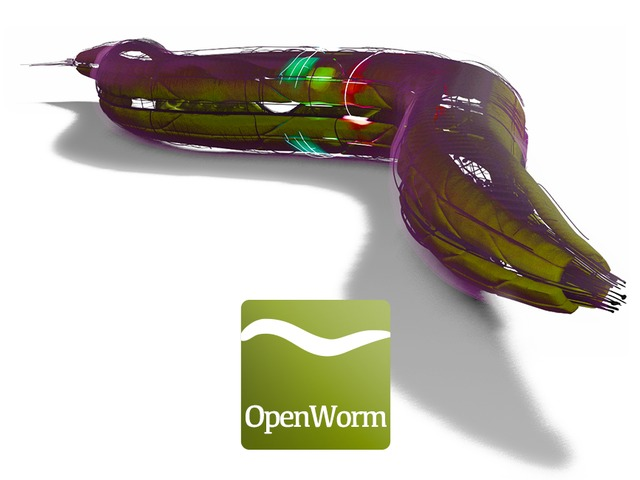
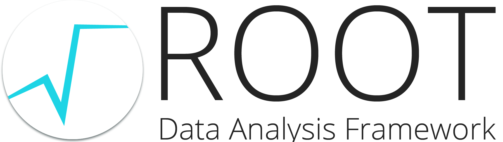

## Science
Aim: understand \<system\>* better (* molecule, species, earth, universe, ...)

<centering></centering>

---

## Scientific Reality

<centering></centering>

---

## What is not part of this

---

### ***time*** for improvements not directly contributing to the scientific progress, e.g.
  - infrastructure software development
  - refactoring / restructuring of code
  - long term maintenance of code

---

### ***education*** of software development skills
  - best practices for code style
  - quality assurance
    - test driven development
    - continuous integration
  - version control
  - validation

---

### ***money*** for
  - software development training courses
  - non-scientific software developers
  - software infrastructure (IT, self hosted services, ...)

---

## Additional issues

---

### ***trust***
  - for **seemingly** small projects software is quickly self-implemented
  - for **complex** projects commercial software **seems** more reliable

---

### ***trust***
  - publication comes first, software release _maybe_ later
  - making errors is taboo, reputation issue
  - publishing code pushes scientific progress
      - Pioneering in code publication  
       [Izhikevich (2006) Polychronization: Computation with Spikes](https://doi.org/10.1162/089976606775093882)
      - Reimplementation and examination  
       [Pauli et al. (2018) Reproducing Polychronization: A Guide to Maximizing the Reproducibility of Spiking Network Models](https://doi.org/10.3389/fninf.2018.00046)

---

### ***dedication***
  - software development is a side occupation
    - no extended time reserved for this
    - not continuous task, but on demand
    - has a low priority compared to scientific findings and publications

  - rapid changes in staff & small / not clearly defined user base
  - no dedicated team per software project   funding usually supports individuals
  - focus on numeric precision

---

## Examples of open source scientific software projects

---

<table><tr valign="top"><td width="70%">
### [odMLtables](https://odmltables.readthedocs.io)

</td><td width="30%">

</td></tr></table>

  - extends usability of open metadata markup language (odML)
  - interface between common laboratory formats (xls/csv) and odML
  - additional utility functionalities

---

## [odMLtables](https://odmltables.readthedocs.io)

  - initiated in 2015
  - 1 developer
  - 0 contributors
  - 1-10 users
  - 1 publication

---

<table><tr valign="top"><td width="70%">
### [Neo](https://neo.readthedocs.io)

</td><td width="30%">

</td></tr></table>

  - interface between 30+ electrophysiology dataset formats (proprietary & open)
  - standardized data representation

---

## [Neo](https://neo.readthedocs.io)

  - initiated in 2009
  - successor of previous electrophysiology data handling packages
  - used in 130+ repositories
  - 3 developers (3 labs)
  - 55 contributors (8 active)
  - ~100 direct users

  - presented at scientific conferences & workshops

---

### [Nest]((https://www.nest-simulator.org/))

  - simulator for spiking neural network models
  - scales from laptops to exascale computers [[Jordan et al. 2018](https://doi.org/10.3389/fninf.2018.00002)]
  - community-standard

---

## [Nest](https://www.nest-simulator.org/)

  - initiated in 1993
  - owned by _The Neural Simulation Technology Initiative_
  - \> 10 developers (5 active)
  - 1 funded position for project documentation
  - 79 contributors (>10 active)
  - dedicated [website](https://www.nest-simulator.org/) (news, announcements, tutorials, videos, brochures)
  - publication list (user / software development)
  - dedicated nest conferences & user workshops & hackathons

---

## There's a lot more
<table><tr valign="top"><td width="50%">

Neuroscience

Biology

  

</td><td width="50%">

Physics

    

... and a large and growing number of smaller projects

<td></table>

---

## What can you do?

### ... as software developer
  - talk to scientists to discover new interesting problems
  - get involved in existing scientific projects and provide feedback

  - make your documentation readable by non-experts, _'installation for dummies'_
  - advertise existing software within potential user community (conferences, workshops)

---

### ... as scientific open software project

  - involve a large user (and potential contributor) base
  - simplify usage and contribution on all levels
      * user & developer guide
      * tutorials
      * solve simple issues first
      * define project standards and contribution guide
  - advertise within potential user community

---

### ... as scientist

  - use existing open source tools, don't start from scratch
  - make sure your software outlives your career
      - [bestpractices.coreinfrastructure.org](https://bestpractices.coreinfrastructure.org)
  - create links to other packages
  - integrate your project into larger framework

  - consider software development aspects from the beginning

---

## Scientific Vision

<centering></centering>

---

## Thank you!

---

# Backup slides

---

## Recommendations for institutes

  - provide kickstart in basic software development techniques
      - version control, coding standards, CI
      - pair programming, test driven development, code review
      - <strike> scrum </strike>, kanban
  - have a dedicated software coordinator
  - define project standards
  - organize hackathons / topic weeks / workshops

---

## Additional references
### Using markdown and pandoc for presentations
- [Creating slides with pandoc](https://www.chronicle.com/blogs/profhacker/markdown-slideshow-example-pandoc/46683)
- [Example markdown presentation](http://wcm1.web.rice.edu/slides/onlinepub.txt)
- [Using pandoc to create reveal.js slides](https://github.com/jgm/pandoc/wiki/Using-pandoc-to-produce-reveal.js-slides)
- [From markdown to manuscripts](https://kieranhealy.org/blog/archives/2014/01/23/plain-text/)
- [Pandoc examples](https://pandoc.org/demos.html)

---

## Differences Academia & Business

 - Academia
      - reputation of an individual counts
      - longer software development cycles
      - main focus: scientific results & paper publications

 - Business
      - reputation of company counts
      - scrum style software development cycles
      - main focus: product development & marketing

---

---

---

## Stages of scientific software

1) custom code for experiment specific task (e.g. experiment control)
    - for current use only
    - no documentation
    - no reuse possible
    - not maintainable
    - not shareable

---

2) shared code within a small community
    - used by multiple people
    - sparsely documented
    - maintained for the duration of a project
    - reuse would require modifications

---

3) globally shared code
    - used in different projects
    - well documented
    - maintained across projects

---
## Growing number of scientific open software projects & code
  - Increasing awareness of software as scientific basis [Katerbow & Feulner (2018): Recommendations on the Development, Use and Provision of Research Software, Research Software Working Group of the Alliance of German Science Organisations](https://zenodo.org/record/1172988)
  - Funding initiatives will require code & software publication
