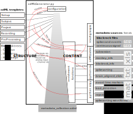

# Introduction

## Neuroscience

  {width=80%}

  <tiny>Brain and spinal cord - manual for the study of the morphology and fibre tracts of the central nervous system (1912) Dr.med. Emil Villinger</tiny>

## But what does this tell us?

  {width=80%}

## Additional information is required

  {width=50% .left}

  Metadata
    * subject
    * brain area
    * preparation technique
    * visualization technique
. . .
    * experimenter
    * weather / season
    * ...

## The importance of reproducibility & metadata

  {width=90%}

## Overview - Involved Projects & Publications

  **Massively parallel multi-electrode recordings of macaque motor cortex during an instructed delayed reach-to-grasp task**
  Brochier, T., Zehl, L., Hao, Y., Duret, M., *Sprenger, J.*, Denker, M., Grün, S., Riehle, A., 2018. Scientific Data 5, 180055. 

  * publication of two complex neuroscientific datasets
  * based on semi-automatic metadata collection organization

  **The _odMLtables_ package**

  **odMLtables: A user-friendly approach for managing metadata of neurophysiological experiments**
  *Sprenger, J.*, Zehl, L., Pick, J., Sonntag, M., Grewe, J., Wachtler, T., Grün, S., Denker, M., 2019. Front. Neuroinform. 13. 

  * open source tool for facilitated metadata collection in the laboratory

  **The _Neo_ package**

  - community based Python package
  - standardized representation of electrophysiological data
  - interfacing to numerous proprietary and open source formats

# An example from the Neurosciences

  

## The metadata concept

  {width=60%}

## Conclusions

  - Facilitate metadata collection for experimentalists
  - Make metadata acquisition & handling more reproducible & transferable

# odMLtables {width=10% .right}

  

## Graphical User Interface

  

# Neo {width=10% .right}

# Workflows

## Workflow concept

  {width=30% .left}

  * modular processing steps (rules)
  * defined input and output files

## Workflow concept

  {width=30% .left}

  * modular processing steps (rules)
  * defined input and output files
  * change propagation
  * relation tracking & visualization

## Workflow management system

  General requirements

  * no additional computational overhead
  * no expert knowledge required
  * standalone
  * visualizable
  * easy to debug
  * actively supported
  * open source

. . .

  Project specific requirements

  * support Python
  * good integration
  * flexibility (bash support)
  * support HPC

## Workflow Implementation

  {width=50% .center}
  {width=8% .right}

## Improvements

  * combination of template structure & automatic enrichment
  * modularization
  * flexible
  * extendable
  * facilitated
    - portability
    - parallelisation

# Conclusion / Summary
