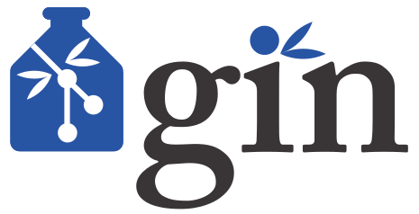

# Introduction

## Neuroscience

  {width=80%}

  Figure from `Brain and spinal cord - manual for the study of the morphology and fibre tracts of the central nervous system (1912) Dr.med. Emil Villinger`

## But what does this tell us?

  {width=80%}

  Figure from `Brain and spinal cord - manual for the study of the morphology and fibre tracts of the central nervous system (1912) Dr.med. Emil Villinger`

## Additional information is required

  {width=60% .left}

  Essential Metadata

  >* date
  * subject
  * brain area
  * preparation technique
  * visualization technique

  . . .

  Additional Metadata

  >* experimenter
  * weather / season
  * experimental notes
  * ...

## Growing importance of reproducibility & collaboration

  {width=80%}

## Overview - Involved Projects & Publications

### Data publication
  >  **Massively parallel multi-electrode recordings of macaque motor cortex during an instructed delayed reach-to-grasp task** 
  >  Brochier, T., Zehl, L., Hao, Y., Duret, M., *Sprenger, J.*, Denker, M., Grün, S., Riehle, A., 2018. Scientific Data 5, 180055. 

### **The _odMLtables_ package**

  > **odMLtables: A user-friendly approach for managing metadata of neurophysiological experiments**  
  > *Sprenger, J.*, Zehl, L., Pick, J., Sonntag, M., Grewe, J., Wachtler, T., Grün, S., Denker, M., 2019. Front. Neuroinform. 13. 

### **The _Neo_ package**

  - community based Python package
  - standardized representation of electrophysiological data
  - interfacing to numerous proprietary and open source formats

# Neuroscience today

## A recent example _Brochier et al. 2018_

  {width=55% .left}

### Overview

  * 96 high sampling recording electrodes
  * proprietary recording devices
  * custom recording setup
  * ~ 10,000 metadata values per session

## The metadata concept

  {width=50% .right}

  * multiple, diverse source files
  * hierarchical metadata collection
  * scripted aggregation of metadata
    1. generation of hierarchical structure
    2. enrichment with metadata

## The metadata concept

  {width=50% .right}

   * structure and content are not completely independent
  * convoluted generation and enrichment process
  * interdependent scripts and requirement for manual inspection & tracking

## Conclusions

  - Facilitate metadata collection for experimentalists
  - Make metadata acquisition & handling more reproducible & transferable

# odMLtables

## {width=10% .left} </t> odMLtables

  

## Graphical User Interface

  

# Neo

## {width=10% .left}

  {width=45% .left}
  {width=45% .right}

# Workflows

## Workflow concept

  {width=30% .left}

  * modular processing steps (rules)
  * defined input and output files

## Workflow concept

  {width=30% .left}

  * modular processing steps (rules)
  * defined input and output files
  * change propagation
  * relation tracking & visualization

## Workflow management system

  General requirements

  * no additional computational overhead
  * no expert knowledge required
  * standalone
  * visualizable
  * easy to debug
  * actively supported
  * open source

. . .

  Project specific requirements

  * support Python
  * good integration
  * flexibility (bash support)
  * support HPC

## Workflow Implementation

  {width=50% .center}
  {width=8% .right}

## Improvements

  * combination of template structure & automatic enrichment
  * modularization
    * separation of generic and project specific aspects
    * reusability in other contexts
  * flexible
  * extendable
  * combined data & metadata
  * facilitated
    - portability
    - parallelisation

# Summary & Conclusion

##

  * new tools & methods are needed for comprehensive data and metadata handling in the Neurosciences
  * odMltables facilitates the standardized metadata collection in laboratory environments
  * Neo provides a extensive conversion capabilities for proprietary & open electrophysiological formats & forms a standardized data representation for further data processing
  * workflow management systems are a suitable approach for comprehensive metadata management for complex experiments & a basis for reproducible science

  *

## Thank you!

  
  {width=20%}
  {width=30%}
  {width=15%}
  
  {width=10%}
  {width=20%}
  
  {width=10%}
  

# Additional slides

## Reach2Grasp Metadata aggregation

  

## Workflow outlook

  

## Overview - Involved Projects & Publications

### Data publication

  * publication of two complex neuroscientific datasets
  * based on semi-automatic metadata collection organization

### **The _odMLtables_ package**

  * open source tool for facilitated metadata collection in the laboratory

### **The _Neo_ package**

  - community based Python package
  - standardized representation of electrophysiological data
  - interfacing to numerous proprietary and open source formats
