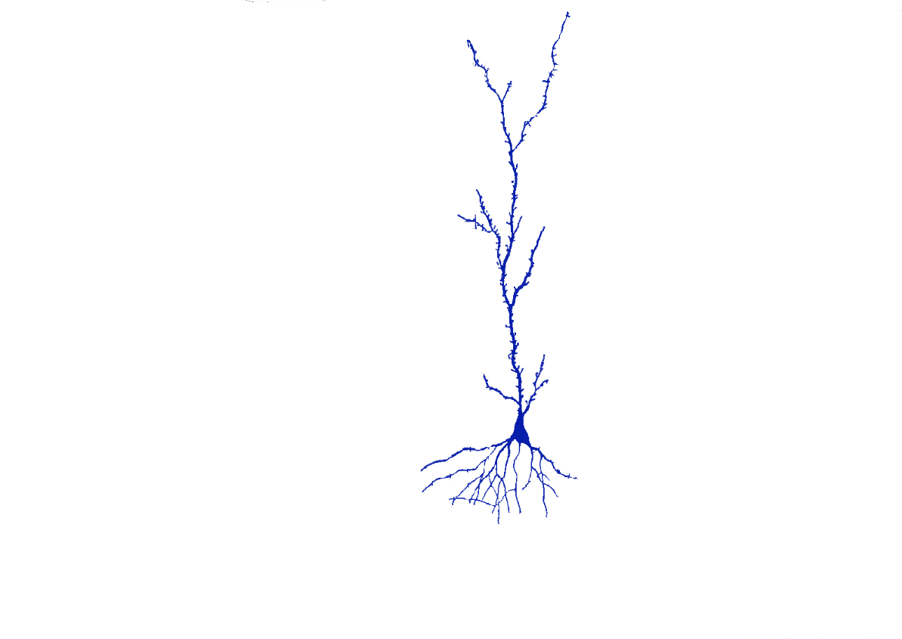
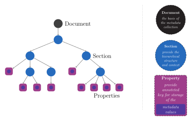
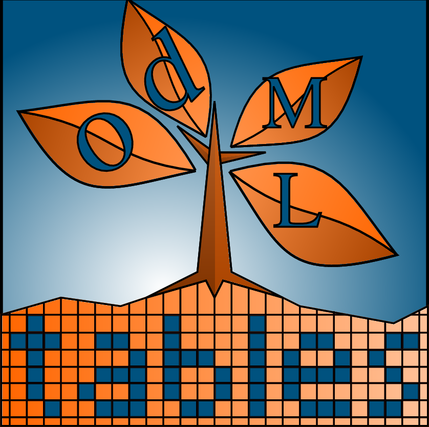
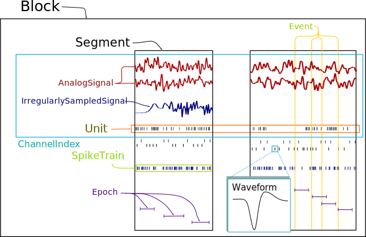
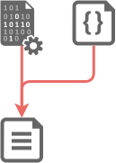
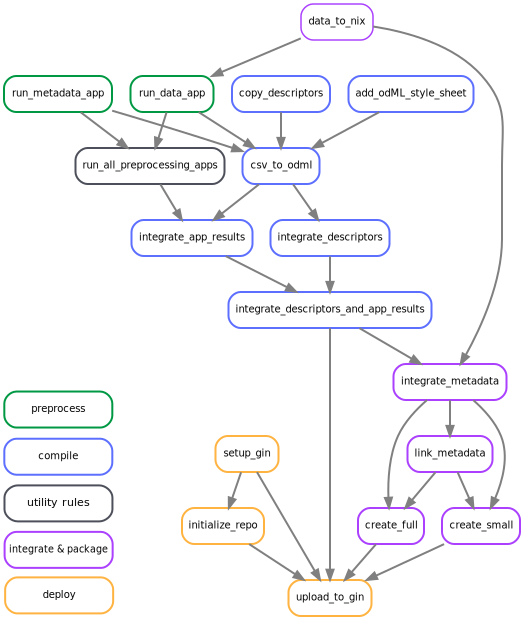

# Introduction

## Neuroscientific data - a historic example

  Image of a neuron, 1912

  {width=70%}

  <tiny>Figure adapted from ___Brain and spinal cord - manual for the study of the morphology and fibre tracts of the central nervous system (1912) Dr.med. Emil Villinger___</tiny>

## But what does this tell us?

  {width=70%}

  <tiny>Figure adapted from ___Brain and spinal cord - manual for the study of the morphology and fibre tracts of the central nervous system (1912) Dr.med. Emil Villinger___</tiny>

## Additional information is required

### Recording data

  {width=60% .left}

### Metadata

  >* brain area
  * species
  * date and time
  * preparation technique
  * visualization technique

  . . .

  Additional Metadata

  >* experimenter
  * temperature
  * experimental notes, etc

  . . .

  Additional data modalities

  

  >* electric activity of neurons
  * connectivity between cells, etc

  

## Growing importance of reproducibility & collaboration

 Fraction of publications relating to reproducibility and collaboration

 {width=60%}

  Figure based on data from [PubMed](https://www.ncbi.nlm.nih.gov/pubmed/) using [Corlan (2004)](http://dan.corlan.net/medline-trend.html).

## Overview — projects & publications

### Data publication ([gin.g-node.org/INT/multielectrode_grasp](https://gin.g-node.org/INT/multielectrode_grasp))
  >  **Massively parallel multi-electrode recordings of macaque motor cortex during an instructed delayed reach-to-grasp task** 
  >  Brochier, T., Zehl, L., Hao, Y., Duret, M., *Sprenger, J.*, Denker, M., Grün, S., Riehle, A., 2018. Scientific Data 5, 180055. 

### **The _odMLtables_ package** ([github.com/inm-6/python-odmltables](https://github.com/inm-6/python-odmltables))

  > **odMLtables: A user-friendly approach for managing metadata of neurophysiological experiments**  
  > *Sprenger, J.*, Zehl, L., Pick, J., Sonntag, M., Grewe, J., Wachtler, T., Grün, S., Denker, M., 2019. Front. Neuroinform. 13. 

### **The _Neo_ package** ([github.com/neuralensemble/python-neo](https://github.com/neuralensemble/python-neo))

  - open source, community based Python package
  - standardized representation of electrophysiological data
  - interfacing to numerous proprietary and open source formats

## Neuroscience today — _Brochier et al. 2018_

  {width=70%}

  >* ~ 5GB data per session (proprietary formats)
   * ~ 10k metadata values per session (various formats)

## Requirements for modern neuroscience

There is need for

  - comprehensive metadata organization → odML, *odMLtables*
  - comprehensive data organization → *Neo*
  - systematic organization of data & metadata processes → *modular workflow approach*

# Metadata Management

## open metadata Markup Language — odML

  {width=70%}

<table><tr><td width="50%">
  * hierarchical metadata structure
  * generic objects
  * human & machine readable
</td><td width="50%">
  * limited support for manual interaction
  * needs to be generated based   on metadata source files & *manual notes*
  </td></table>

## {width=10% .left} </t> odMLtables

  * conversion between tabular metadata structures and odML
  * generic spreadsheet software can be used for metadata collection
  * additional utility functions

  

## Graphical user interface

  {width=50% .left}

    

  * easy access to the _odML_ format   also for non-programmers
  * 5 main functionalities available   as `wizard` dialogs for step-wise   configuration  of odMLtables function
  * saving of configuration   settings for repeated use
  * `wizards` are linked in _odML-ui_   for simplified accessiblity

# Handling of Electrophysiological Data

## {width=15%}

### Neo as interface
  {width=42%}

## {width=15%}

  {width=45% .right}

### Neo as interface

   
   

  * interface to >30 proprietary   & open data formats
  * generic, standardized data   representation for electrophysiological   data
  * basis for applications and   scripts working on the data

## {width=15%}

### Neo as standardized data representation

  {width=50% .right}

### Features

  * object oriented representation
    * data objects
    * container objects
  * generic structure
  * support for custom metadata   via object names & annotations
  * utility functions

### Recent updates

  * data related annotations (array annotations)
  * interface to  additional formats (neuralynx, nest, blackrock, nix)
  * extended utilities (trial based slicing, resampling, ...)
  * simplification of  object structure
  * performance improvements and refactoring

# A Process for Data & Metadata Management

## _Brochier et al. 2018_ — The metadata concept  

  {width=60% .right}

### Metadata pipeline

  * scripted aggregation of metadata
    1. generation of hierarchical   structure
    2. enrichment with   metadata

## _Brochier et al. 2018_ — The metadata concept  

  {width=60% .right}

### Metadata pipeline

  * scripted aggregation of metadata
    1. generation of hierarchical   structure
    2. enrichment with   metadata

## _Brochier et al. 2018_ — The metadata concept  

  {width=60% .right}

### Metadata pipeline

  * scripted aggregation of metadata
    1. generation of hierarchical   structure
    2. enrichment with   metadata
  * multiple, diverse source files

## _Brochier et al. 2018_ — The metadata concept

  {width=60% .right}

### Issues

  * structure and content are not   completely independent  
    → *convoluted generation* and   enrichment process
  * *monolithic, linear compilation   script*  
    → obscured compilation   mechanism
  * requires manual inspection   of output for *status tracking*
  * *reuse* in other context requires   extended adjustments
  * *detached* for data and   metadata storage

## Improvement of the metadata concept

### Solutions approach

  {width=30% .right}

**Combination of data and metadata in a single framework**  
  → *Nix* format (*Neo*) captures data and metadata
   

**Systematic modularization of the compilation process**

  * less maintenance
  * easier to reuse in other projects
  * improved tracking of compilation process
  * explicit dependencies

→*Workflow management systems* (*snakemake*) for organization of data and metadata processes

# Workflows

## Workflow concept

  {width=30% .left}

  * modular processing steps (rules)
  * defined input and output files

## Workflow concept

  {width=30% .left}

  * modular processing steps (rules)
  * defined input and output files
  * change propagation
  * relation tracking & visualization

## Workflows in science

### From data recording to reproducible publications using workflows

  {width=45% .left}

  * visualization of dependencies   and execution status
  * portable and extendable via   via modular approach
  * combined data & metadata packaging   using *Nix*
  * enables automatized provenance   tracking on file level

## Workflows in science

### From data recording to reproducible publications using workflows

  {width=45% .left}

  * visualization of dependencies   and execution status
  * portable and extendable via   via modular approach
  * combined data & metadata packaging   using *Nix*
  * enables automatized provenance   tracking on file level

## Workflows in science

### From data recording to reproducible publications using workflows

  {width=45% .left}

  * visualization of dependencies   and execution status
  * portable and extendable via   via modular approach
  * combined data & metadata packaging   using *Nix*
  * enables automatized provenance   tracking on file level

## Workflow implementation

  Visualization of snakemake rules {width=4% .left}   
  {width=45% .left}

### Advantages

  * categorization of rules based   on application level
  * separation of *generic* and   project specific rules
  * parallelization capabilities
  * explicit *dependency description*   and visualization
  * flexibly *extendable*
  * no separation of metadata   structure & content
  * *automatic propagation* of changes

# Summary & Outlook

## Summary

 * Based on our data publication _Brochier et al. 2018_ we identified deficiencies and issues in designing a scalable, portable, generic, rigorous workflow for data and metadata acquisition. Based on this we designed solutions which close these gaps:
  * By providing _odMLtables_ we facilitate the standardized metadata collection in laboratory environments.
  * We contributed major functionality to the _Neo_ package that was lacking in building our acquisition workflow.
  * We devise a portable, modular approach for reproducible data and metadata management based on _workflow management systems_ that scales from experimental data acquisition to data and analysis publication.

## Outlook
  * integration of *odMLtables* functionality into _odML_ package
  * continuation of *Neo* development for extended support of formats, better user friendliness & improved performance
  * implementation of workflows on a larger scale using cluster computing and remote data files
  * application of workflow concept in different projects
  * integration with larger frameworks, e.g. HBP infrastructures

## Thank you!

  {height=80px}
  {height=80px}
  {height=80px}
  {height=80px}
  {height=80px}
  {height=80px}
  {height=80px}
  {height=80px}
  {height=80px}
  {height=80px}

  {width=100%}
