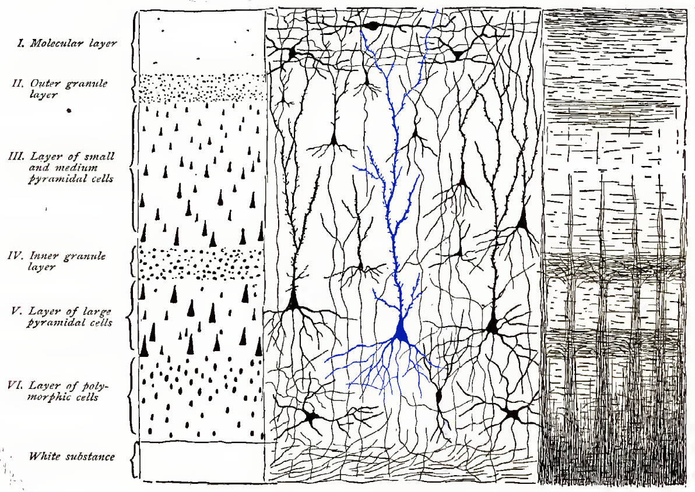
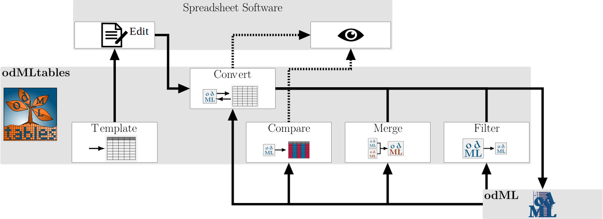
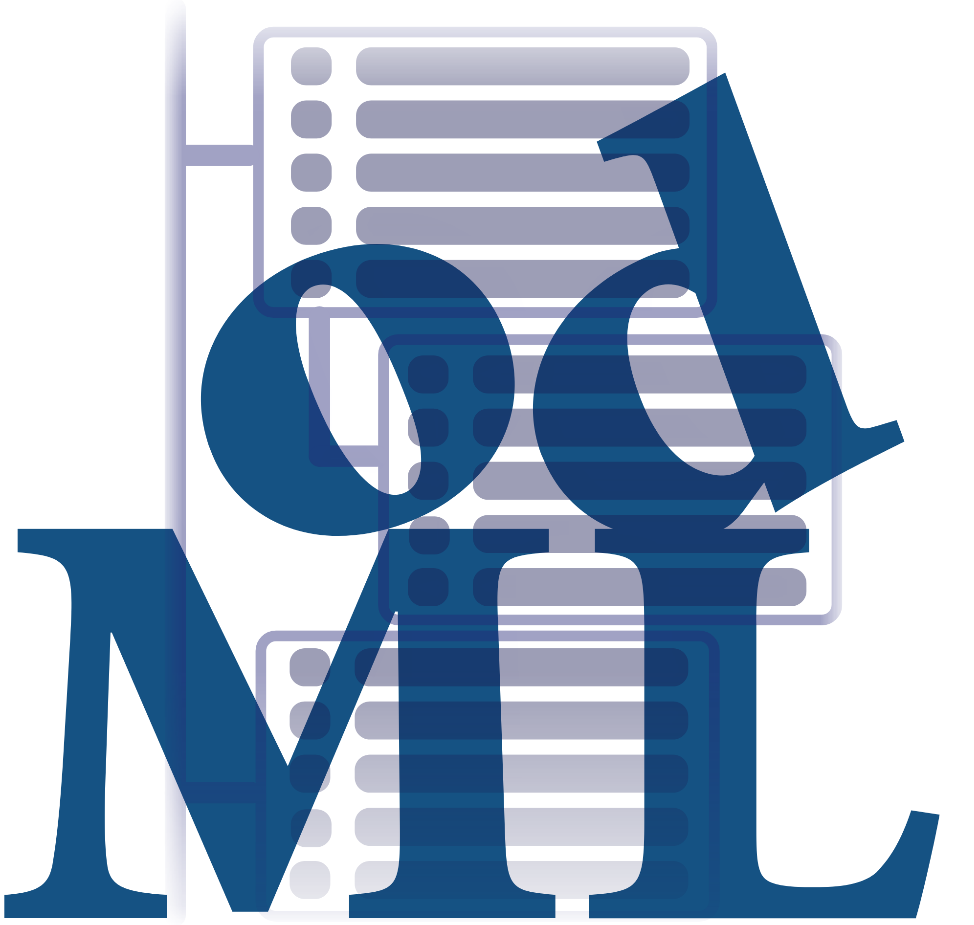
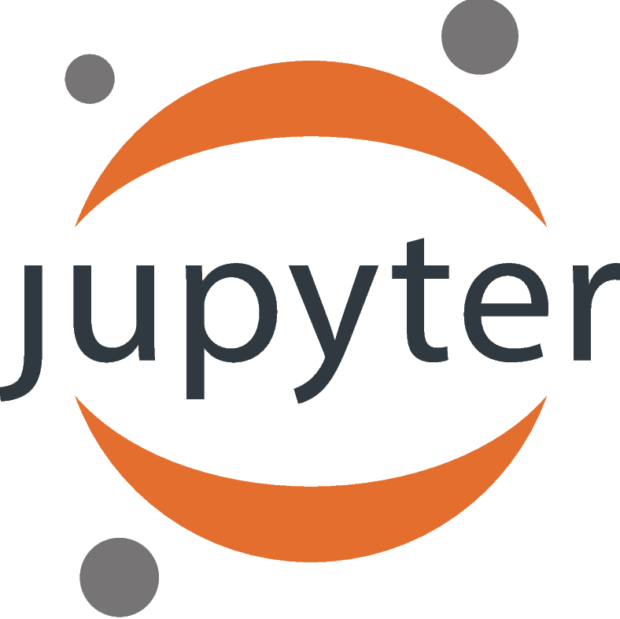
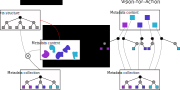
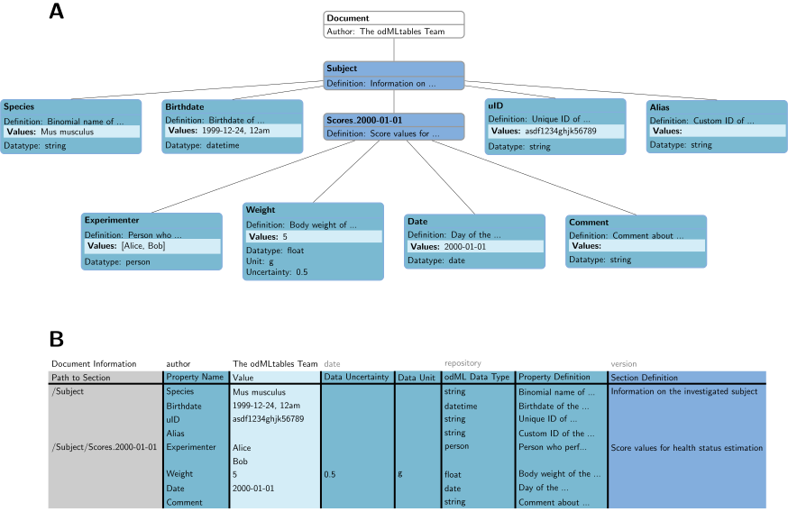

# Introduction

## Neuroscience

  Image of a neuron, 1912

  {width=70%}

  <tiny>Figure adapted from ___Brain and spinal cord - manual for the study of the morphology and fibre tracts of the central nervous system (1912) Dr.med. Emil Villinger___</tiny>

## But what does this tell us?

  {width=70%}

  <tiny>Figure adapted from ___Brain and spinal cord - manual for the study of the morphology and fibre tracts of the central nervous system (1912) Dr.med. Emil Villinger___</tiny>

## Additional information is required

### Recording data

  {width=60% .left}

### Metadata

  >* date and time
  * brain area
  * subject
  * preparation technique
  * visualization techniquec

  . . .

  Additional Metadata

  >* experimenter
  * temperature
  * experimental notes, etc

  . . .

  Additional data modalities

  

  >* electric activity of neurons
  * connectivity between cells, etc

  

## Growing importance of reproducibility & collaboration

 Fraction of publications relating to reproducibility and collaboration
  {width=70%}
  <tiny> based on data from [Corlan (2004)](http://dan.corlan.net/medline-trend.html) and [PubMed](https://www.ncbi.nlm.nih.gov/pubmed/) </tiny>

## Overview — projects & publications

### Data publication
  >  **Massively parallel multi-electrode recordings of macaque motor cortex during an instructed delayed reach-to-grasp task** 
  >  Brochier, T., Zehl, L., Hao, Y., Duret, M., *Sprenger, J.*, Denker, M., Grün, S., Riehle, A., 2018. Scientific Data 5, 180055. 

### **The _odMLtables_ package**

  > **odMLtables: A user-friendly approach for managing metadata of neurophysiological experiments**  
  > *Sprenger, J.*, Zehl, L., Pick, J., Sonntag, M., Grewe, J., Wachtler, T., Grün, S., Denker, M., 2019. Front. Neuroinform. 13. 

### **The _Neo_ package**

  - open source, community based Python package
  - standardized representation of electrophysiological data
  - interfacing to numerous proprietary and open source formats

# Neuroscience today

## A recent example — _Brochier et al. 2018_

  {width=45% .left}

### Overview

  * 96 recording electrodes
  * sampling rate 30kHz
  * online  & offline signal processing
  * custom recording setup
  * ~ 10k metadata values per session

  * proprietary recording devices & formats
  * ~ 5GB data per session

## Requirements for modern neuroscience

There is need for

  - comprehensive metadata organization → odML, *odMLtables*
  - comprehensive data organization → *Neo*
  - systematic organization of data & metadata processes → *workflow management systems*

# Metadata Management

## open metaData Markup Language — odML

  {width=45% .left}

  * hierarchical metadata structure
  * generic objects
  * human & machine readable
  * limited support for manual interaction

  * needs to be generated based   on metadata source files & *manual notes*

## {width=10% .left} </t> odMLtables

  * conversion between tabular metadata structures and odML
  * generic spreadsheet software can be used for metadata collection
  * additional utility functions

  

## Graphical user interface

  {width=40% .left}

  * easy access to the _odML_ format   also for non-programmers
  * 5 main functionalities available   as `wizard` dialogs for step-wise configuration   of odMLtables function
  * saving of configuration   settings for repeated use
  * wizards are linked in _odML-ui_   for simplified accessiblity

# Data Management

## {width=15%}

  {width=45% .left}

### Features

  * generic, standardized data   representation for electrophysiological   data
  * basis for higher level data   processing tools
  * interface to >30 proprietary   & open data formats

## {width=15%}

  {width=50% .right}

### Features

  * object oriented representation
    * data objects
    * container objects
  * generic structure
  * custom names &  annotations
  * utility functions

### Recent updates

  * data related annotations
  * interface to  additional formats
  * extended utilities
  * simplification of  object structure
  * performance improvements and refactoring

# Data & Metadata Management in Practice

## _Brochier et al. 2018_ — The metadata concept  

  {width=50% .right}

### Metadata pipeline

  * multiple, diverse source files
  * hierarchical metadata collection
  * scripted aggregation of metadata
    1. generation of hierarchical   structure
    2. enrichment with metadata

## _Brochier et al. 2018_ — The metadata concept

  {width=50% .right}

### Issues

  * *monolithic, linear compilation script*
  * structure and content are not   completely independent  
    → *convoluted generation* and   enrichment process
  * requires manual inspection   of output for *status tracking*
  * compilation mechanism is   obscured in scripts
  * *reuse* in other context requires   extended adjustments
  * separate storage of compiled   metadata and original data files

. . .

  **Solutions**

  * *Nix* format (*Neo*) can capture metadata and data
  * *Workflow management systems* for organization data and metadata processing

# Workflows

## Workflow concept

  {width=30% .left}

  * modular processing steps (rules)
  * defined input and output files

## Workflow concept

  {width=30% .left}

  * modular processing steps (rules)
  * defined input and output files
  * change propagation
  * relation tracking & visualization

## Workflows in science

### From data recording to reproducible publications using snakemake {width=8% .right}

  {width=50% .left}

  * visualization of dependencies   and execution status
  * portable and extendable via   via modular approach
  * combined data & metadata packaging   using *Nix*
  * enables automatized provenance tracking on file level

## Workflow implementation

  {width=50% .left}

### Advantages {width=8% .right}

  * categorization of rules based   on application level
  * separation of generic and   project specific rules
  * parallelization capabilities
  * explicit dependency handling
  * flexibly extendable
  * no separation of metadata   structure & content
  * selective, automated execution upon   change in source file

# Summary & Outlook

## Summary

  * _Brochier et al. 2018_ demonstrates that new tools & methods are needed for comprehensive data and metadata handling in the neurosciences
  * _odMltables_ facilitates the standardized metadata collection in laboratory environments
  * _Neo_ provides a extensive conversion capabilities for proprietary & open electrophysiological formats & forms a standardized data representation for further data processing
  * _workflow management systems_ are a suitable approach for comprehensive metadata management for complex experiments & a basis for reproducible science

## Outlook
  * integration of *odMLtables* functionality into _odML_ package
  * continuation of *Neo* development for extended support of formats, better user friendliness & improved performance
  * implementation of workflow on a larger scale using cluster computing and remote data files
  * application of workflow concept in different projects
  * integration with larger frameworks, e.g. HBP infrastructures

## Thank you!

  {height=80px}
  {height=80px}
  {height=80px}
  {height=80px}
  {height=80px}
  {height=80px}
  {height=80px}
  {height=80px}
  {height=80px}
  {height=80px}

  {width=100%}

# Additional slides

## Reach2Grasp Metadata aggregation

  {width=60%}

## Overview - Involved Projects & Publications

### Data publication

  * publication of two complex neuroscientific datasets
  * based on semi-automatic metadata collection organization

### **The _odMLtables_ package**

  * open source tool for facilitated metadata collection in the laboratory

### **The _Neo_ package**

  - community based Python package
  - standardized representation of electrophysiological data
  - interfacing to numerous proprietary and open source formats

## {width=15%}

### Recent development

  * support of new formats
    * Neuralynx
    * latest Blackrock version
    * Nix
  * unification of reader API
  * simplification of object structure
  * data linked custom annotations
  * extension of utility functionality

### Outlook

  * improvements of object structure
    * replacement of ambiguous objects
    * shift from graph to hierarchical structure
  * integration with related formats (EEG, Imaging)
  * integration with simulation software (nest)

## Workflow management system

  General requirements

  * no additional computational overhead
  * no expert knowledge required
  * standalone
  * visualizable
  * easy to debug
  * actively supported
  * open source

. . .

  Project specific requirements

  * support Python
  * good integration
  * flexibility (bash support)
  * support HPC

## Comparison R2G & V4A

  

## odMLtables mapping

  
