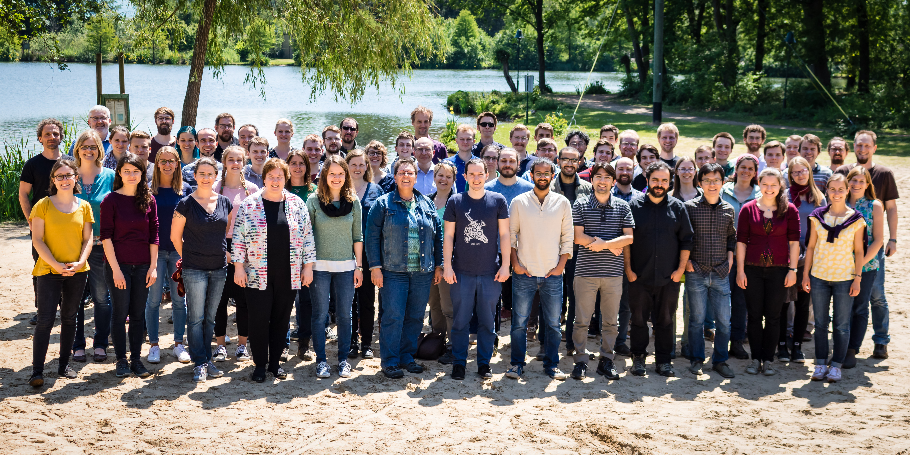

# Introduction

## Neuroscience

  {width=80%}

  <tiny>Figure adapted from ___Brain and spinal cord - manual for the study of the morphology and fibre tracts of the central nervous system (1912) Dr.med. Emil Villinger___</tiny>

## But what does this tell us?

  {width=80%}

  <tiny>Figure adapted from ___Brain and spinal cord - manual for the study of the morphology and fibre tracts of the central nervous system (1912) Dr.med. Emil Villinger___</tiny>

## Additional information is required

  {width=60% .left}

  Essential Metadata

  >* date
  * subject
  * brain area
  * preparation technique
  * visualization technique

  . . .

  Additional Metadata

  * experimenter
  * weather / season
  * experimental notes
  * ...

## Growing importance of reproducibility & collaboration

  {width=80%}

## Overview - Involved Projects & Publications

### Data publication
  >  **Massively parallel multi-electrode recordings of macaque motor cortex during an instructed delayed reach-to-grasp task** 
  >  Brochier, T., Zehl, L., Hao, Y., Duret, M., *Sprenger, J.*, Denker, M., Grün, S., Riehle, A., 2018. Scientific Data 5, 180055. 

### **The _odMLtables_ package**

  > **odMLtables: A user-friendly approach for managing metadata of neurophysiological experiments**  
  > *Sprenger, J.*, Zehl, L., Pick, J., Sonntag, M., Grewe, J., Wachtler, T., Grün, S., Denker, M., 2019. Front. Neuroinform. 13. 

### **The _Neo_ package**

  - community based Python package
  - standardized representation of electrophysiological data
  - interfacing to numerous proprietary and open source formats

# Neuroscience today

## A recent example — _Brochier et al. 2018_

  {width=55% .left}

### Overview

  * 96 recording electrodes
  * sampling rate 30kHz
  * online  & offline signal processing
  * proprietary recording devices
  * custom recording setup
  * ~ 10k metadata values per session

## The metadata concept

  {width=50% .right}

### Metadata pipeline

  * multiple, diverse source files
  * hierarchical metadata collection
  * scripted aggregation of metadata
    1. generation of hierarchical  structure
    2. enrichment with metadata

  {width=45% .left}

## The metadata concept

  {width=50% .right}

### Issues

  * manual generation of   source files is laborious   using _odml_ features
  * structure and content are not   completely independent  
    → convoluted generation and   enrichment process
  * requires manual inspection   of output for status tracking
  * compilation mechanism is   obscured in scripts
  * reuse in other context requires   extended adjustments

## Conclusions

There is need for

  - *facilitated metadata collection* for experimentalists
  - *unification* of data and metadata formats
  - improved metadata acquisition & handling in terms of *reproducibility* & *transferability*

# odMLtables

## {width=10% .left} </t> odMLtables

  * conversion between tabular metadata structures and odML
  * generic spreadsheet software can be used for metadata collection
  * additional utility functions

  

## Graphical User Interface

  {width=40% .left}

  * easy access to the _odML_ format   also for non-programmers
  * 5 main functionalities available   as `wizard` dialogs for step-wise configuration   of odMLtables function
  * saving of configuration   settings for repeated use
  * wizards are linked in _odML-ui_   for simplified accessiblity

# Neo

## {width=15%}

  {width=90% .left}

## {width=15%}

  {width=80%}

### Features

  * generic, standardized data representation for electrophysiological data
  * basis for higher level data processing tools
  * interface to >30 proprietary & open data formats

## {width=15%}

### Recent development

  * Support of new formats
    * Neuralynx
    * latest Blackrock version
    * Nix
  * unification of reader API
  * simplification of object structure
  * data linked custom annotations
  * extension of utility functionality

### Outlook

  * improvements of object structure
    * replacement of ambiguous objects
    * shift from graph to hierarchical structure
  * integration with related formats (EEG, Imaging)
  * integration with simulation software (nest)

# Workflows

## Workflow concept

  {width=30% .left}

  * modular processing steps (rules)
  * defined input and output files

## Workflow concept

  {width=30% .left}

  * modular processing steps (rules)
  * defined input and output files
  * change propagation
  * relation tracking & visualization

## Workflow management system

  General requirements

  * no additional computational overhead
  * no expert knowledge required
  * standalone
  * visualizable
  * easy to debug
  * actively supported
  * open source

. . .

  Project specific requirements

  * support Python
  * good integration
  * flexibility (bash support)
  * support HPC

## Workflow Implementation

  {width=50% .center}
  {width=8% .right}

## Improvements

  * combination of template structure & automatic enrichment
  * modularization
    * separation of generic and project specific aspects
    * reusability in other contexts
  * flexible
  * extendable
  * combined data & metadata
  * facilitated
    - portability
    - parallelisation

# Summary & Outlook

## Summary

  * _Brochier et al. 2018_ demonstrates that new tools & methods are needed for comprehensive data and metadata handling in the neurosciences
  * _odMltables_ facilitates the standardized metadata collection in laboratory environments
  * _Neo_ provides a extensive conversion capabilities for proprietary & open electrophysiological formats & forms a standardized data representation for further data processing
  * _workflow management systems_ are a suitable approach for comprehensive metadata management for complex experiments & a basis for reproducible science

## Outlook
  * integration of *odMLtables* functionality into _odML_ package
  * continuation of *Neo* development for better integration, user friendliness & performance
  * implementation of metadata workflow using cluster computing and remote data files
  * transfer of generic workflow rules to other projects and initialization of public rule collection

## Thank you!

  {height=80px}
  {height=80px}
  {height=80px}
  {height=80px}
  {height=80px}
  {height=80px}
  {height=80px}
  {height=80px}
  {height=80px}
  {height=80px}

  {width=100%}

# Additional slides

## Reach2Grasp Metadata aggregation

  {width=60%}

## Workflow outlook

  {width=60%}

## Overview - Involved Projects & Publications

### Data publication

  * publication of two complex neuroscientific datasets
  * based on semi-automatic metadata collection organization

### **The _odMLtables_ package**

  * open source tool for facilitated metadata collection in the laboratory

### **The _Neo_ package**

  - community based Python package
  - standardized representation of electrophysiological data
  - interfacing to numerous proprietary and open source formats
