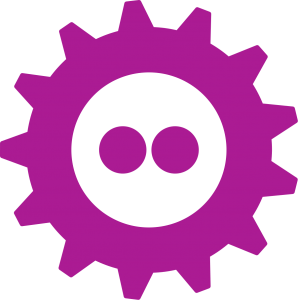

# FOSDEM 2020 {width=10%}

  [fosdem.org](https://fosdem.org)

  - Free and Open source Software Developers' European Meeting
  - Brussels 1-2 February 2020
  - 8000+ participants
  - 837 talks

  - 100% live streamed
  - talks available [online](https://fosdem.org/2020/schedule/events/)

# Schedule

  - 56 parallel developer rooms
  - 7 main tracks
    - Community and Ethics
    - Containers and Security
    - Databases
    - Freedom
    - History
    - Internet
    - Miscellaneous

# Parallel tracks (devrooms)

  - [Continuous Integration and Continuous Deployment](https://fosdem.org/2020/schedule/track/continuous_integration_and_continuous_deployment/)
  - [Free tools and editors](https://fosdem.org/2020/schedule/track/free_tools_and_editors/)
  - [HPC, Big Data, and Data Science](https://fosdem.org/2020/schedule/track/hpc_big_data_and_data_science/)
  - [Open Document Editors](https://fosdem.org/2020/schedule/track/open_document_editors/)
  - [Python](https://fosdem.org/2020/schedule/track/python/)
  - [Quantum Computing](https://fosdem.org/2020/schedule/track/quantum_computing/)
  - [Open Research Tools and Technologies devroom](https://fosdem.org/2020/schedule/track/open_research_tools_and_technologies/) **(first time!)**

# Interesting talks
  - [Double your contributors using these 3 simple tricks! - Why would someone work on your project?](https://fosdem.org/2020/schedule/event/gamedev_double_contributors_tricks/)
  - [Interactive applications on HPC systems - Jupyterhub, Galaxy, RStudio, XPRA](https://fosdem.org/2020/schedule/event/interactive_hpc/)
  - [Production-time Profiling for Python](https://fosdem.org/2020/schedule/event/python2020_profiling/)
  - [Will somebody *please* tell me what's going on? Managing change in Python projects ](https://fosdem.org/2020/schedule/event/python2020_manage_change/)
  - [Asyncio: understanding asynic and await in Python](https://fosdem.org/2020/schedule/event/python2020_asyncio/)
  - [How to write a scikit-learn compatible estimator/transformer](https://fosdem.org/2020/schedule/event/python2020_scikit_learn_estimator/)
  - [Correlation analysis in automated testing](https://fosdem.org/2020/schedule/event/testing_correlation_analysis_automated_testing/)
  - [How to fail successfully and reliably - And look good while doing it](https://fosdem.org/2020/schedule/event/testing_fail_successfully_reliably/)

# Open Research Tools and Technologies (devroom)
[Open Research Tools and Technologies devroom](https://fosdem.org/2020/schedule/track/open_research_tools_and_technologies/)

  1. Open software development in *research*
  2. Open software in the social sciences / humanities / journalism

  - mainly tool focused talks
  - conceptual overlap with humanities

# Open Research Tools and Technologies (devroom)
  - *Jan Grewe* [The good and the bad sides of developing open source tools for neuroscience](https://fosdem.org/2020/schedule/event/open_research_oss_tools_neuro/)
    - advantages and disadvantages of using OSS in science
  - *Julia Sprenger* [Challenges and opportunities in scientific software development](https://fosdem.org/2020/schedule/event/open_research_science_soft_dev/)
    - differences between scientific and classical software development
    - actions required on all sides to improve situation
  - *Aniket Pradhan* [NeuroFeodora: Enableing Free/Open Neuroscience](NeuroFedora: Enabling Free/Open Neuroscience)
    - an OS for neuroscience research
    - 130 neuroscience packages ready to use
    - 120+ more packages will be added
  - *Jan Hanke* [DataLad](https://fosdem.org/2020/schedule/event/open_research_datalad/)
    - general-purpose tool to manage data across different repos
    - capable of handling large datasets via git-annex
    - provenance tracking & complete decentralization
  - *Lilly Winfree*  [Frictionless Data for Reproducible Research](https://fosdem.org/2020/schedule/event/open_research_frictionless_data/)
    - metadata aggregation, validation and curation pipelines for oceanographic data
    - [open knowledge foundation](https://okfn.org/)
    - [frictionlessdata](create.frictionlessdata.io) & data validation [goodtables](try.goodtables.io)

# Open Research Tools and Technologies (devroom)
  - *Mateusz Kuzak* [On the road to sustainable research software](https://fosdem.org/2020/schedule/event/open_research_sustainable_soft/)
    - 4OSS simple recommendations (OSS from the beginning)
    - Develop a publicly accessible open-source code from day one.
    - Discoverable software by providing software metadata via a popular community registry.
    - Adopt a license and comply with the licence of third-party dependencies.
    - Clear and transparent contribution, governance and communication processes.

  - *Sébastien Rochette* [Transforming scattered analyses into a documented, reproducible and shareable workflow](https://fosdem.org/2020/schedule/event/open_research_shareable_workflow/)
    - *collaboration fest*, R workshop for supporting software development in the sciences
  - *Emmy Tsang* (Innovation Community Manager eLife) [A community-driven approach towards open innovation for research communication](https://fosdem.org/2020/schedule/event/open_research_elife/)
    - feedback is essential & always welcome
    - recent innovation example: *live paper*
  - *Karthik Ram* [The Journal of Open Source Software Credit for invisible work](https://fosdem.org/2020/schedule/event/open_research_joss/)
    - paper publication for mature software packages in the sciences
    - minimal effort for deserved credit (`2h paper, 1-2pages`)

# **Check out [fosdem.org](fosdem.org)!**

# Notes
  Feedback to [Challenges and opportunities in scientific software development](https://fosdem.org/2020/schedule/event/open_research_science_soft_dev/)
  
  - questions
    - Software carpentry - For general programming skills, not for our particular softwares
    - How to better connect scientists to not duplicate software? - NFDI
  - comments
    - startup idea for collaborative workspace platform based on Jupyter Notebooks
    - humanities have dedicated software engineers funded
    - only innovative business departments use agile methods (e.g. some VW departements)
    - how to convince research groups to test agile methods?

# Highlights from other talks

## open knowledge foundation
 - making data available
 - organize: licencing, data cleaning, ..
 - dedicated data managers for cleaning, annotation of data, quality assurance, gaps...

## create.frictionlessdata.io
- metadataformat: json
- packaging data + metadata
- validation: try.goodtables.io
- mistaken identifiers: gene name errors when using excel
- datapackage-pipelines
- bco-dmo.org

## [A community-driven approach towards open innovation for research communication](https://fosdem.org/2020/schedule/event/open_research_elife/) - Emmy Tsang (Jounal of open source science)
