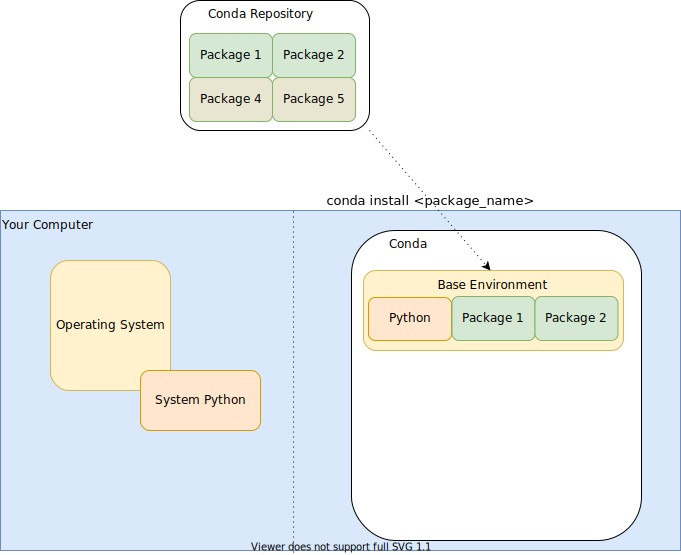

# Why Python?

## Why programming when there's graphical tools?
- limitations of graphical user interface
- black-box effect

## But what about Excel?

- good for
  - office data organization
  - simple data manipulation
  - quick visualization

- not suited for
  - reproducible data analysis
  - modularization of data, computation and visualization
  - *large* datasets
  - distributed datasets
  - complex computation
  - automation of computation and visualization
  - sharing of computations

## ... and Matlab?

- Matlab features
  - focus on matrix manipulation and program solving related to Linear Algebra
  - additional functionality available via *Toolboxes*
  - a single integrated development environment
  - a single, commercial developer: MathWorks
  - requires a licence

- Python features
  - high level general purpose programming language
  - specific functionality available via *Packages*
  - diverse fields of application
  - community based
  - free and open
  - very flexible language, 'easy' for learning programming

## What is 'programming'?

- providing set of instruction to be executed by the computer
- text file of instructions: script
- scripts can make use of
  - basic language inherent commands
  - other scripts
  - other installed libraries/*packages*/*toolboxes*
- conventional file extensions for storing scripts
  - Python `.py` /  Matlab `.m`
- scripts are interpreted (/compiled) and executed non interactively

# The Python World

## Python on your computer


Conda: Package, dependency and environment management for any language—Python, R, Ruby, Lua, Scala, Java, JavaScript, C/ C++, FORTRAN, and more.

[https://docs.conda.io](https://docs.conda.io)

_On linux_ you can check all available Python instances using `whereis python`

## _Action_ Install (mini)conda on your computer

- Download the latest miniconda installer from [https://docs.conda.io/en/latest/miniconda.html](https://docs.conda.io/en/latest/miniconda.html)
- Follow the regular install instructions using the default settings ([https://conda.io/projects/conda/en/latest/user-guide/install/index.html](https://conda.io/projects/conda/en/latest/user-guide/install/index.html))
- Locate Python
  - On Windows: Open an Anaconda prompt (`Start menu` > `Anaconda prompt`)
  - On Linux: Open a terminal
- Confirm Python and miniconda packages were successfully installed
  - by running `conda list`
  - have a '(base)' prefix in your prompt


## Package Management

{width=35% .left}

### Conda
>- view installed packages: `conda list`
- install package `conda install <package_name>`
- use `<package_name>==1.0.0` to install fix version
- conda channels: collection of packages for specific fields
  - anaconda (default), bioconda, conda-forge, ...
- specify channel to use via `--channel <channel_name>`

. . .

- **general note**: remember to use `--help` to get an overview of available arguments

## Python Package Management

{width=50% .left}

### Python Package Index - PyPI

[https://pypi.org/](https://pypi.org/)

>- Python packages **only**
- corresponding package manager: pip
- pip itself is a python package
- installs on same level as pip

## Environments

{width=50% .left}

- dedicated package versions
- environment creation:
  - `conda create -n <name> python`
- show existing environments:
  - `conda env list`
- switch / activate an environment
  - `conda activate <name>`
- leave an environment
  - `conda deactivate`

## _Action_ Environment creation

- Create a new environment with python version `3.9`
- use the environment name 'BHMexercise'
- verify the environment contains `pip`
- use conda to install a package named `spyder`
- use pip to install a package named `xlrd`
- use conda to verify the installation(s)
  - is conda aware of pip-installed packages?

# Let's code Python

## Execution and output

- Create a text file `my_first_script.py`
- use your preferred text editor to add the following line

```
print('hello world')
```

- save the file
- run `python my_first_script.py` in your terminal

> Numerous Python tutorials exist. This one is heavily inspired by [https://www.learnpython.org/](https://www.learnpython.org/).
> For more resources on the topic see also [https://wiki.python.org/moin/BeginnersGuide/Programmers](https://wiki.python.org/moin/BeginnersGuide/Programmers)

## Variables and data types

Python is a calculator!
- replace the content of the print with a simple calculation, e.g. `1+3`. What happens if you use `'1+3'` instead?

### Variables
Define the content of the `print()` statement in an earlier line. You can assigne a value to a variable using the `=` symbol. The value on the right is assigned (stored) in the variable on the left.
Try this `to_print='hello world'` and print the content of the variable.

### Data types
- `''` indicates a _string_
- Numbers are automatically handles either as _integer_ or _float_ (or _complex_, e.g. for `3+3j`)
- True / False values are stored as _boolean_
- To identify which data type is currently used for a variable, use `type()`


%  {height=80px}
%  {height=80px}
%  {height=80px}
