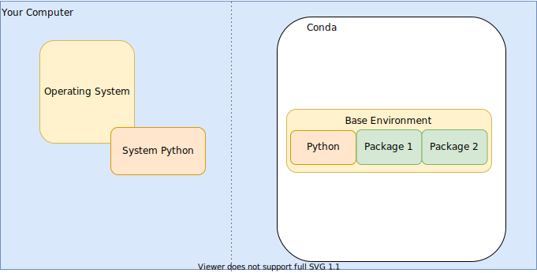
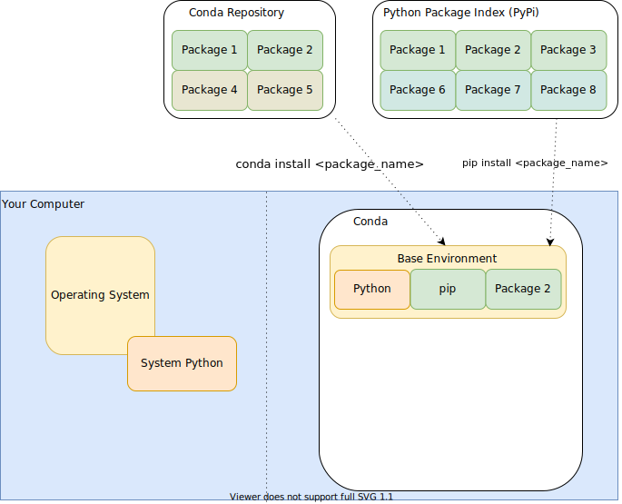

# Why Python?

## Why programming when there's graphical tools?
- limitations of graphical user interface
- black-box effect

## But what about Excel?

- good for
  - office data organization
  - simple data manipulation
  - quick visualization

- not suited for
  - reproducible data analysis
  - modularization of data, computation and visualization
  - *large* datasets
  - distributed datasets
  - complex computation
  - automation of computation and visualization
  - sharing of computations

## ... and Matlab?

- Matlab features
  - focus on matrix manipulation and program solving related to Linear Algebra
  - additional functionality available via *Toolboxes*
  - a single integrated development environment
  - a single, commercial developer: MathWorks
  - requires a licence

- Python features
  - high level general purpose programming language
  - specific functionality available via *Packages*
  - diverse fields of application
  - community based
  - free and open
  - very flexible language, 'easy' for learning programming

## What is 'programming'?

- providing set of instruction to be executed by the computer
- text file of instructions: script
- scripts can make use of
  - basic language inherent commands
  - other scripts
  - other installed libraries/*packages*/*toolboxes*
- conventional file extensions for storing scripts
  - Python `.py` /  Matlab `.m`
- scripts are interpreted (/compiled) and executed non interactively

# The Python World

## Python on your computer


Conda: Package, dependency and environment management for any language—Python, R, Ruby, Lua, Scala, Java, JavaScript, C/ C++, FORTRAN, and more.

[https://docs.conda.io](https://docs.conda.io)

_On linux_ you can check all available Python instances using `whereis python`

## _Action_ Install (mini)conda on your computer

- Download the latest miniconda installer from [https://docs.conda.io/en/latest/miniconda.html](https://docs.conda.io/en/latest/miniconda.html)
- Follow the regular install instructions using the default settings ([https://conda.io/projects/conda/en/latest/user-guide/install/index.html](https://conda.io/projects/conda/en/latest/user-guide/install/index.html))
- Locate Python
  - On Windows: Open an Anaconda prompt (`Start menu` > `Anaconda prompt`)
  - On Linux: Open a terminal
- Confirm Python and miniconda packages were successfully installed
  - by running `conda list`
  - have a '(base)' prefix in your prompt


## Package Management

{width=35% .left}

### Conda
>- view installed packages: `conda list`
- install package `conda install <package_name>`
- use `<package_name>==1.0.0` to install fix version
- conda channels: collection of packages for specific fields
  - anaconda (default), bioconda, conda-forge, ...
- specify channel to use via `--channel <channel_name>`

. . .

- **general note**: remember to use `--help` to get an overview of available arguments

## Python Package Management

{width=50% .left}

### Python Package Index - PyPI

[https://pypi.org/](https://pypi.org/)

>- Python packages **only**
- corresponding package manager: pip
- pip itself is a python package
- installs on same level as pip

## Environments

{width=50% .left}

- dedicated package versions
- environment creation:
  - `conda create -n <name> python`
- show existing environments:
  - `conda env list`
- switch / activate an environment
  - `conda activate <name>`
- leave an environment
  - `conda deactivate`

## _Action_ Environment creation

- Create a new environment with python version `3.9`
- use the environment name 'BHMexercise'
- verify the environment contains `pip`
- use conda to install a package named `numpy`
- use pip to install a package named `xlrd`
- use conda to verify the installation(s)
  - is conda aware of pip-installed packages?

# Let's code Python

## _Action_ Execution and output

- Create a text file `my_first_script.py`
- use your preferred text editor to add the following line

```
print('hello world')
```

- save the file
- run `python my_first_script.py` in your terminal

> Numerous Python tutorials exist. This one is heavily inspired by [https://www.learnpython.org/](https://www.learnpython.org/).
> For more resources on the topic see also [https://wiki.python.org/moin/BeginnersGuide/Programmers](https://wiki.python.org/moin/BeginnersGuide/Programmers)

## Variables and data types

Python can be your calculator!

- replace the content of the print with a simple calculation, e.g. `1+3`. What happens if you use `'1+3'` instead?

### Basic data types

- `''` indicates a _string_
- Numbers are automatically handles either as _integer_ or _float_ (or _complex_, e.g. for `3+3j`)
- `True` / `False` values are stored as _boolean_
- To identify which data type is currently used for a variable, use `type()`
- You can explicitly convert to a data type, e.g. using `str()`, `int()`, `float()` or `bool()`, even though this is considered bad Python style.

### Operations
Basic operators

- `+`, `-`, `*`, `/`, `%` (modulo), `**` (power), `//` (integer divison) work like a calculator on numbers
- but can also be used with other data types, e.g. `'Brainhack' + 'Marseille'`

## _Task_ Explore data types

- What happens if you try to add a string and a number?
- Can you multiply a string and an integer?
- Print the result of the `1+4` calculation with a descriptive text, e.g. `The sum of 1 and 4 is '5'`

## Variables
Define the content of the `print()` statement in the line and use `print()` only in the second line. You can assign a value to a variable using the `=` symbol.

- The value on the right is assigned (stored) in the variable on the left.
- You can also assign the result of an operation to a variable

- _Task_: Try this `to_print = 'hello world'` and print the content of the variable in the 2nd line of code.

## Comparison

To compare two values the `==` operation can be used. Both sides will be compared and the result will be a boolean value (`True`/`False`). You can use `not` to invert a boolean value

- _Task_: What is the result for the comparisons of `5==1+4`? Does this change for `0.3==0.1+0.1+0.1`?


## Comments

With a growing number of lines present in your script it is usefull to add some comments explaining what your code is about. You can add comment lines in your script by adding `#` at the beginning. Python will ignore these lines.

## Lists

A list stores multiple values/elements. The elements can be of different types.


Use `my_list = [1, 2, 3]`. You can access the different elements stored in the list via their index. Python uses **0-based** indexing, so the first element in the list can be retrieved via `my_list[0]`. To get the total number of elements in a list use `len()`.

List entries can also be indexed counting from the end of the list. For this use a negative index, e.g. `my_list[-1]` will give the last element.

- _Task_: Print the type of the list and the 2nd value as well as its type

## Modifying a list

- You can add a value to a list by using `append()`. This is a method of the list, so use `my_list.append(4)`
- _Task_: Print the resulting list and confirm it has now 4 elements.
- _Task_: Try to access the individual characters (elements) of a string via the same method. How can you find out the number of elements in a string?
- _Task_: Try to replace the first element of the list by the `5`.

## Loops
To do an operation with each element of a list, we need to loop over all elements. This can be done using a `for` loop:

```
for elem in my_list:
    print(elem)
```

Here the value assigned to `elem` changes for each iteration of the loop. The line `print(elem)` will be called for each element of the `my_list` list once.

Note that all lines that you want to loop across need to be indented consistently for Python to recognize them. By convention this indentation should consist of 4 spaces.

## Range

If you want to iterate over a range of numbers instead of an existing list, Python provides the `range()` function.

```
for elem in range(3):
    print(elem)
```

Here, range will on the fly generate 3 elements (`0`, `1` and `2`). Note that `3` is not included here.

_Task_

- Print each element of `my_list` by using `range` and accessing the corresponding element of `my_list` inside of the loop.
- Range can take multiple arguments: `start`, `stop` and `step`. Can you print only even numbers between 10 and 20?


## Dictionaries
A dictionary is an data structure complementary to a list. In a dictionary data are stored as a key-value pair. A dictionary is defined via curly braces

```
my_dict = {'event': 'Brainhack', 'location': 'Marseille'}
```

We can access or set a particular value via its key:

```
my_dict['event']
```

_Task_

- Define the dictionary as above. In a separate line of code add a 3rd entry with the key `'year'` and the value `2021`

## Dictionaries - looping

You can also loop over a dictionary. The element that you loop across is in this case the key.

```
for elem in my_dict:
  print('My key is ' + elem)
```

To iterate over keys and values at the same time use the `.items()` method:

```
for key, value in my_dict.items():
    print('The value for the key ' + key + ' is ' + value)
```

## Conditions

To execute pieces of code only when specific criteria are met an `if` condition can be used. E.g. to only print even numbers up to 20 you can use
```
for i in range(20):
    if (i % 2)==0:
      print(i)
```
Here the condition `(i % 2)==0` is evaluated to a boolean value (`True`/`False`) and the print is only performed in case of `True`.


## Nested Data

Elements of lists or dictionaries can be lists or dictionaries itself.

_Task_

- Create a list that contains 5 dictionaries - one for each of the past Brainhack Marseille events. Use the correct for each event.


## Using packages
Thousands of Python packages exist to extend the functions available for your code. The basic ones are already in Python directly.

### Imports
To make the functionality of package available within your code you need to import the package. Here we are loading a package for reading data from a comma-separated-values (csv) file:

```
import csv
```

## Using imports

Now we can use the csv package to create a reader for a csv file. First we open the file using the Python `open()` function, then we provide this access to the file to the `csv` package to read the content of the file.

```
import csv

with open('example.csv', newline='') as f:
    reader = csv.reader(f)
    data = list(reader)

print(data)
```

To learn about the functionality provided by a package, check the `help()` or it's documentation, in this case  the [csv documentation](https://docs.python.org/3/library/csv.html).

_Task_

- convert the list of lists that is stored in `data` into a list of dictionaries, containing a dictionary per person. As keys of the dictionary use the first row (header) of the csv table.

# Next steps

## Easier coding with IDEs
 A number of integrated development environments exist. The level of complexity and support can very from basic to fully integrated with other software development tools. Here a list of tools that are commonly used (order by increasing complexity)
 - [Jupyter notebook](https://jupyter.org/install)
 - [Spyder](https://docs.spyder-ide.org/current/installation.html)
 - [Visual Studio Code](https://code.visualstudio.com)
 - [PyCharm](https://www.jetbrains.com/pycharm/)

## Outlook
A lot of Pythons power lies in Packages. For advanced data handling and functionality check out the following packages:

- [NumPy](https://numpy.org/): Efficient data representation & computation based on arrays
- [SciPy](https://scipy.org/): Scientific Python, builds on NumPy
- [SymPy](https://sympy.org): Symbolic Python, algebraic operations
- [Pandas](https://pandas.pydata.org/) Data manipulation

This tutorial only covered the very beginning of Python basics. If you want to learn more use one of the numerous Python tutorials online, e.g. [https://www.learnpython.org/](https://www.learnpython.org/)
