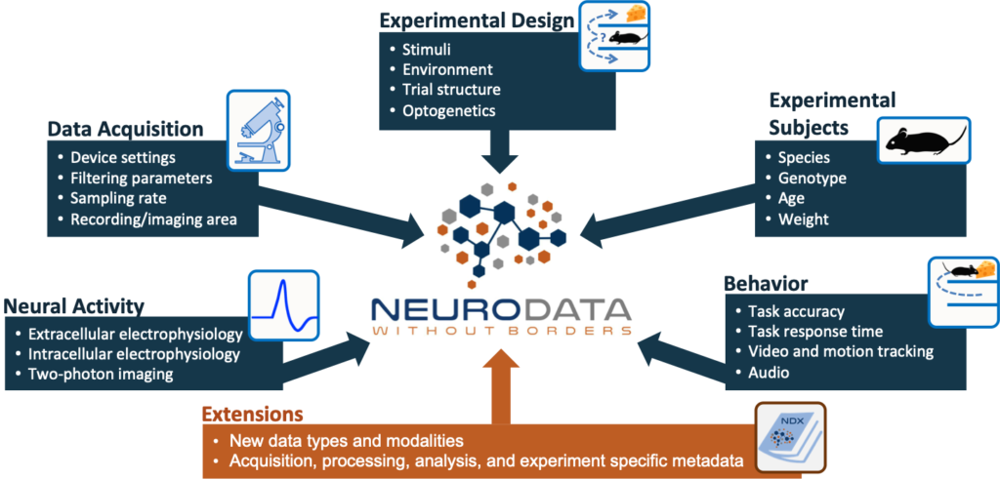
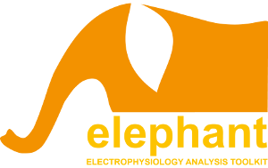
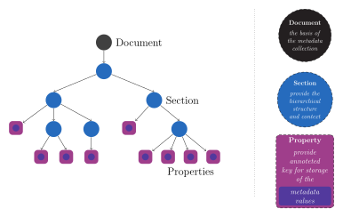
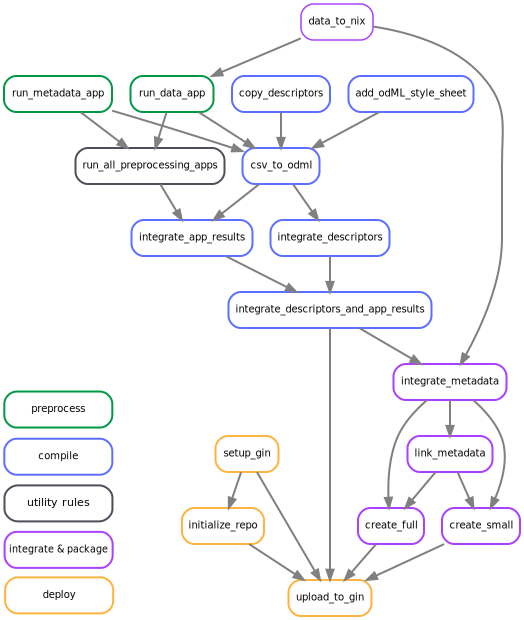
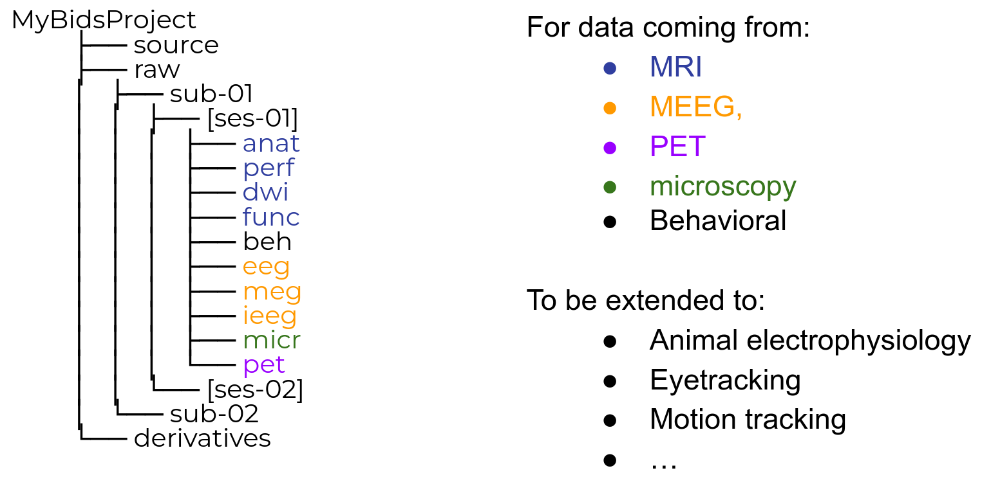

# Tools for data and metadata organization

## Data access & standardization: [Neo](https://neo.readthedocs.io/en/latest/)

- interfaces with 30+ electrophysiology formats
- recent addition: imagesequence & region of interest representation
- standardized structure for data representation


## Neo usage example

  Loading datasets from different formats into same framework

  ```python
  import neo

  io = neo.get_io('my_recording_session_path')
  block = io.read_block()

  ```

## Packaging and sharing data and metadata

Linking of data and metadata: [Neuroscience Information eXchange format](https://nixio.readthedocs.io/en/latest/)

  - Combines data and metadata (odML format) in a single framework
  - Domain independent
  - Generic data structure for scientific data

## Neurodata Without Border ([NWB](www.nwb.org))



## [Spikeinterface](https://spikeinterface.readthedocs.io)

A Python interface to Spike Sorters

- uses Neo to load diversity of data formats
- standardized interface to run sorters, e.g.
  - HDSort
  - Ironclust
  - Kilosort (2, 2.5, 3, pykilosort)
  - Klusta
  - SpykingCircus
  - Tridesclous
  - Yass
- comes with containerized versions of sorters
- provides utility functions for spike sorting comparison

## [Elephant](https://elephant.readthedocs.io)



 - spike and LFP based analysis of ephys data
 - based on Neo, Quantity and Numpy
 - contains a number of spike pattern and higher order correlation methods
 - [in development] is accompanied by a visualization packages for analysis results: [Viziphant](https://viziphant.readthedocs.io)


## Metadata organization: [open metadata markup language](https://g-node.github.io/python-odml/) (odML)

  {width=60% .center}

<table><tr><td width="50%">
  * hierarchical metadata structure
  * generic objects
  * human & machine readable
</td><td width="50%">
  * limited support for manual interaction
  * needs to be generated based <br> on metadata source files & *manual notes*
  </td></table>


## Coordinating & automatization: [Snakemake](https://snakemake.readthedocs.io/en/stable/)

- Modular workflow for data and metadata organization
- separation of project specific and general processing steps
- reusability of modules

{width=40% .center}


# Standardizing across projects and modalities

## Brain Imaging Data Structure (BIDS)




<p style="margin-top:1cm;">
<font color="#808080" size="3">Gau, https://zenodo.org/record/5872274_ </font>
</p>


## Standard data representation: [BIDS-ephys](https://bids.neuroimaging.io/bep032)

  - Extension proposal for BIDS to cover microelectrode electrophysiology data
  - Related tools
    - [Neo](https://neo.readthedocs.io/en/latest/)
    - [ProbeInterface](https://probeinterface.readthedocs.io/en/main/)
    - [BEP032Tools](https://github.com/INT-NIT/BEP032tools) Validation & Generation


## References

- Neo, [https://neo.readthedocs.io](https://neo.readthedocs.io)
- NIX, [https://nixio.readthedocs.io](https://nixio.readthedocs.io)
- NWB, [https://www.nwb.org/](https://www.nwb.org/)
- SpikeInterface, [https://spikeinterface.readthedocs.io](https://spikeinterface.readthedocs.io)
- Elephant, [https://elephant.readthedocs.io](https://elephant.readthedocs.io)
- odML, [https://g-node.github.io/python-odml](https://g-node.github.io/python-odml)
- BIDS, [https://bids.neuroimaging.io](https://bids.neuroimaging.io)
- BIDS-ephys, [https://bids.neuroimaging.io/bep032](https://bids.neuroimaging.io/bep032)
- Snakemake, [https://snakemake.readthedocs.io](https://snakemake.readthedocs.io)
